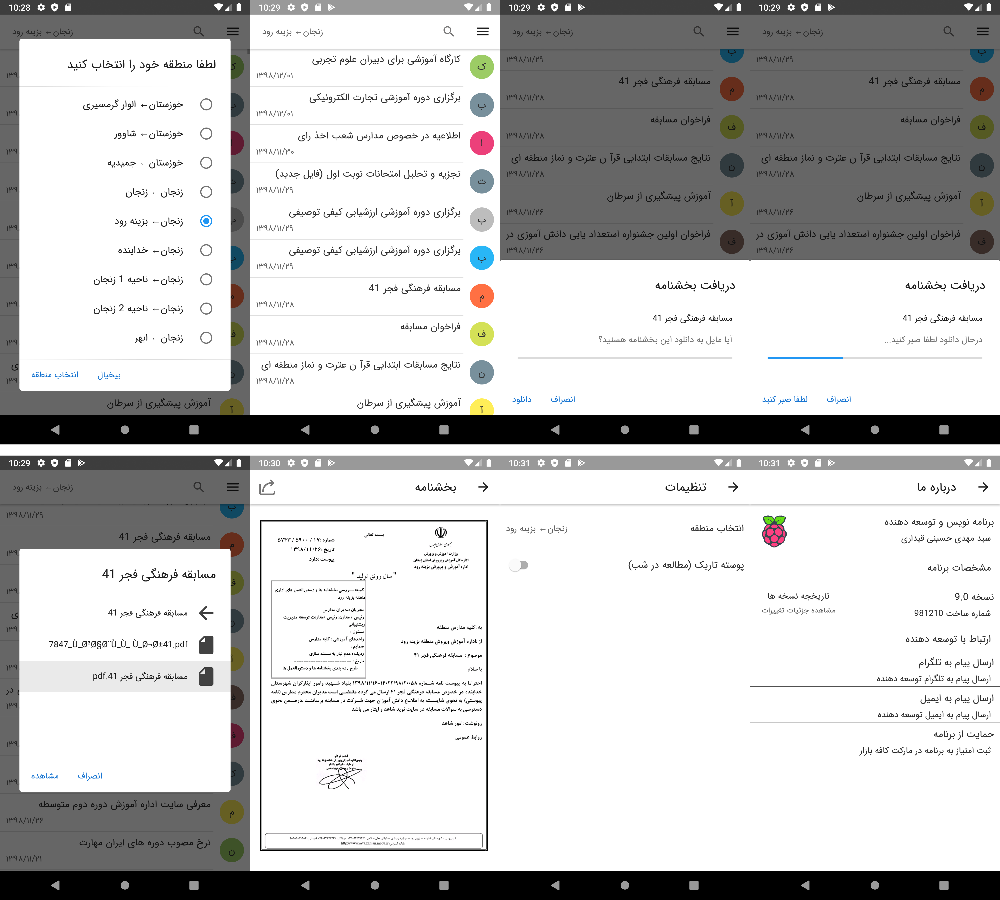
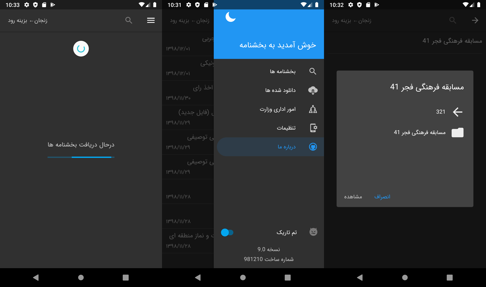

# Circulars-v9.0

  نمایش بخشنامه مناطق مختلف سازمان آموزش و پرورش- نسخه 9 
این اپلیکیشن وابسته به هیچ سازمان و ارگانی نمی باشد و بصورت پروژه شخصی و آزاد ایجاد شده است. همراه این پروژه نکات آموزشی بسیاری برای علاقه مندان به برنامه نویسی موجود می باشد. این اپلیکیشن می تواند فایل ها را در حافظه گوشی دانلود کرده و آنها را از حالت فشرده (فرمت های Rar و Zip) خارج کند و امکان نمایش فایل های Pdf و انواع تصاویر (Tiff, Png, Jpeg) را بصورت داخلی و فایل های آفیس را توسط برنامه های خارجی باز کند

، این نسخه بر اساس تکنولوژی های زیر ایجاد شده است:

- Navigation Component
- Pass Argument Between Views (Fragment)
- Coroutines
- Async-Await
- lifecycle
- Material Design 2
- Support Android 16 -> 29
- Dark and Light Theme
- Kotlin
- AndroidX

## 
 دانلود از کافه بازار

## 
 تصاویر

## 
 کتابخانه های مورد استفاده

[Calligraphy](https://github.com/InflationX/Calligraphy)
[Material-dialogs](https://github.com/afollestad/material-dialogs)
[AndroidPdfViewer](https://github.com/barteksc/AndroidPdfViewer)
[Android-TiffBitmapFactory](https://github.com/Beyka/Android-TiffBitmapFactory)
[PRDownloader](https://github.com/MindorksOpenSource/PRDownloader)
[AndroidP7zip](https://github.com/hzy3774/AndroidP7zip)
[RxAndroid](https://github.com/ReactiveX/RxAndroid)
[AppCenter](https://appcenter.ms)
[Push-Pole](http://push-pole.com)
[Jsoup](https://github.com/jhy/jsoup)

## 
 نسخه های قبلی

https://github.com/ghost1372/Circulars-Version6
 
https://github.com/ghost1372/Circulars-Version4
 
https://github.com/ghost1372/Circulars-Version3
 
https://github.com/ghost1372/Circulars
